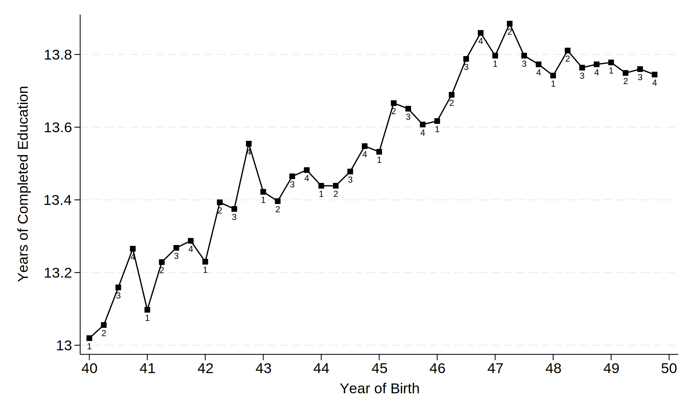
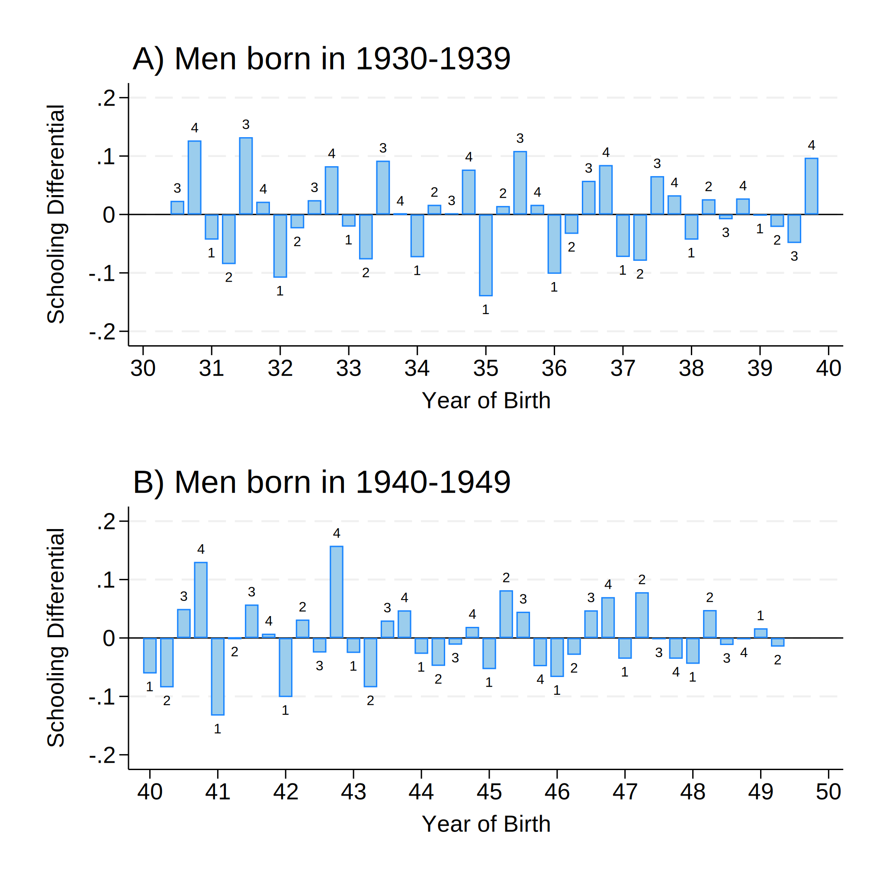
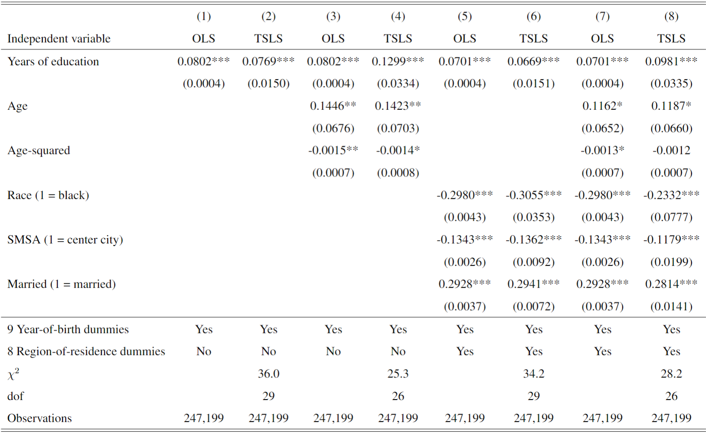

# An Empirical Paper using IV: [Angrist & Krueger (1991)](https://doi.org/10.2307/2937954)
[Angrist & Krueger (1991)](https://doi.org/10.2307/2937954) is one of the best-known papers using instrumental variables (IV) to do empirical research. Here I try my best to replicate their main results. The datasets are available in [Angrist Data Archive](https://economics.mit.edu/people/faculty/josh-angrist/angrist-data-archive) and what I use is `NEW7080.rar` (containing the original 1970 and 1980 census data with all covariates). My cleaned data can be obtained by request ([ianho0815@outlook.com](mailto:ianho0815@outlook.com?subject=[GitHub]%20AK1991)). 

## Research Question and Challenge
Their research question is: **What is the impact of education on earnings?** It is hard to *directly* estimate this impact because education is an endogenous variable (i.e., some other variables, such as unobserved innate ability, can affect education and earnings together). Mathematically, if we run the following regression
$$earning_i = \beta_0 + \beta_1 educ_i + e_i$$
then the estimate of $\beta_1$ is very likely to be biased because the exogeneity assumption fails to hold, i.e., $E(educ_i e_i) \neq 0$.

## Empirical Strategy
Angrist & Krueger (1991) tried to resolve the endogeneity issue by using some instruments for education. Their two-stage least squares (TSLS) model is
$$\ln W_i = X_i \beta + \sum_c Y_{ic} \xi_c + \rho E_i + \mu_i$$
$$E_i = X_i \pi + \sum_c Y_{ic} \delta_c + \sum_c \sum_j Y_{ic} Q_{ij} \theta_{jc} + \epsilon_i$$
where
  * $W_i$ is individual $i$'s weekly wage.
  * $Y_{ic}$ is a dummy variable equaling 1 if individual $i$ was born in year $c$ and 0 otherwise.
  * $E_i$ is individual $i$'s education (e.g., years of attained education).
  * $Q_{ij}$ is a dummy variable equaling 1 if individual $i$ was born in quarter $j$ and 0 otherwise.
  * $X_i$ is a vector of covariates (including age, race, location, married status, etc.).

The authors employed the interactions between year-of-birth dummies and quarter-of-birth dummies as instruments ($Z_{icj} = Y_{ic} \cdot Q_{ij}$). They can be valid instruments if two conditions are satisfied:
  1. **Exclusion condition**: $E(Z_{icj} \mu_i) = 0$. The instruments are uncorrelated with the regression error term $\mu_i$; in other words, the instruments can affect the outcome variable ($\ln wage_i$) only through the education (i.e., the first-stage equation).
  2. **Relevance condition**: $Cov(Z_{icj}, educ_i) \neq 0$. The instruments have a strong association with the education.

As usual, it is hard to perfectly verify the exclusion condition. The authors considered several other channels (other than compulsory schooling) through which the instruments can affect earnings, and then reject them one by one (see Section III of the paper). The most notable test is the last one --- they run the TSLS regression on the sample of college graduates (whose education was not prolonged by the compulsory schooling) and found no effect.

To check the relevance condition, the authors use visualization and OLS regressions (regressing detrended education on dummies for quarter of birth) to show that there is a strong relationship between quarter of birth and education attained. In my opinion, this is the most interesting part of this paper. From the following figures, we can see that the average education is higher for individuals born early in the year, even after we remove the trend in years of education by subtracting the moving average from individual education.

 

 

This phenomenon appeared due to two reasons:
  1. Admission of US schools typically requires students have turned age 6 by January 1 of the year in which he/she enters school. Consequently, students born earlier in the year are slightly older than others when they enter schools. For example, if *A* was born on 2000 Jan 15 (quarter 1) and *B* was born on 2002 Nov 15 (quarter 4), then both *A* and *B* are allowed to enter a school in 2007. However, on 2007 Jan 1, *A* is 6.96 years old while *B* is 6.13 years old.
  2. Many states in the US enacted the compulsory schooling laws (requiring students stay in school until they reach a certain age, usually 16, 17, or 18). As a result, those students born earlier in the year reach the certain age earlier, so they are allowed to quit schooling earlier and then their years of attained education are lower.

## Main Findings
Angrist & Krueger (1991) found that their TSLS estimates were close to the OLS estimates. For example, in the model using 1920-1929 cohort and without covariates, both OLS-estimated and TSLS-estimated return to education are close to 0.08.

